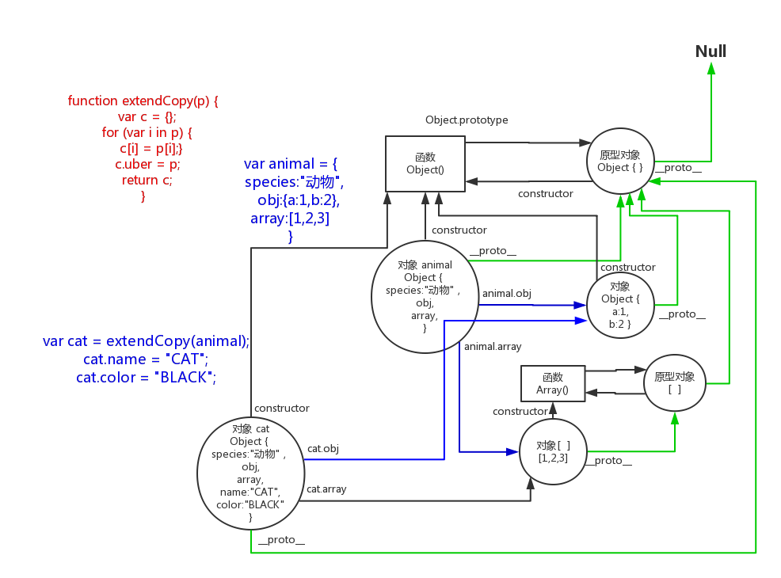
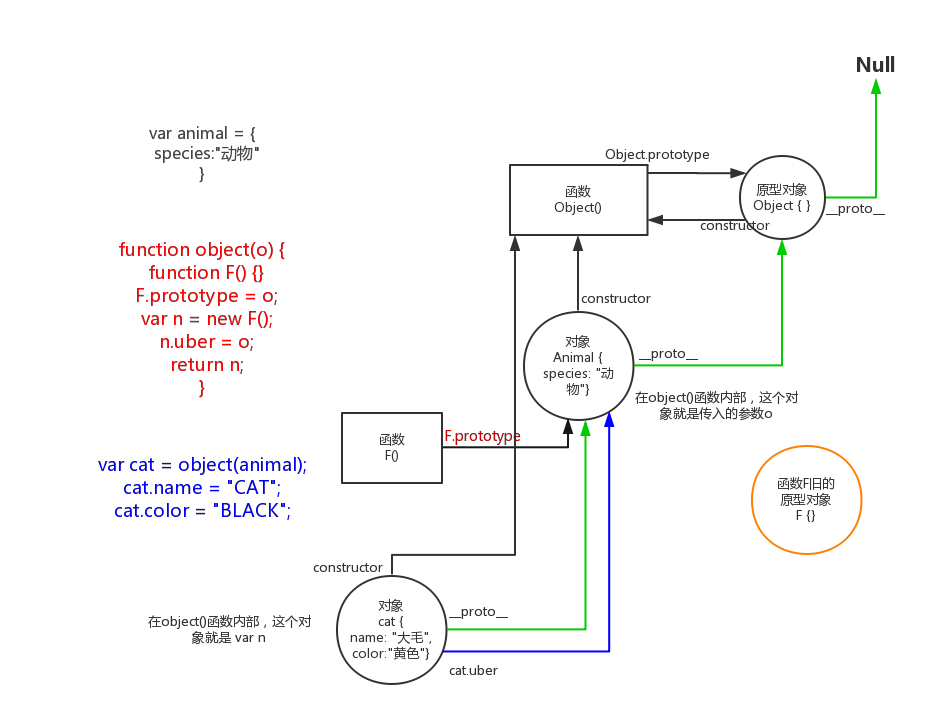

# 第2讲 传统开发人员学习Javascript指南

tags: 作用域 上下文 对象继承 Javascript

[TOC]


## 为什么要学习Javascript

由于`nodejs`的出现， 原本仅局限于前端开发的Javascript，转变为前后端一体化的开发语言。普通前端开发也转变为包括后端的大前端开发。

而传统开发人员一般开发思维偏后端，通过掌握Javascript，可以快速适应前后端一体化的开发模式。

传统开发人员是指
- 桌面系统开发
- 数据库应用开发
- asp.net 开发

## 传统开发人员需要针对Javascript转变哪些思维

- 大量使用回调函数
- 函数参数处理很自由
  需要知道函数源码，才能准备判断该如何调用。或者函数有详细文档说明调用示例 
- 原型继承
- 弱类型
- 无IDE支持
- 缺乏软件工程支持

## 如何快速学习资源

### 学习资源

- ⟪JavaScript 面向对象编程指南⟫  **强力推荐**
- ⟪JavaScript权威指南⟫ 
- ⟪JavaScript高级程序设计⟫ 

### 学习技巧

- 在火狐浏览器用FireBug练习代码
- 不要仅通过网上资源学习，要先使用书本系统学习
- 主要先学习语言本身，Dom和Bom可以用的时候再了解

## Javascript难点说明

### 布尔表达式

传统开发人员在学习js的逻辑运算时，可能好象很容易会了，但看到实际代码时又好象不明白了。
而目前也没有什么书籍对这个问题讲得很清楚。好象觉得就应该是这样，不需要讲清楚。

js的逻辑运算，在不同的场景下是有区别的。
以下的定义，是笔者自拟的，目前没有找到相类似的说法，但是按这种定义比较容易分清楚。

- **条件表达式** : 用于条件判断中的逻辑运算，如 if (a===1)
- **逻辑运算表达式** : 用于非条件判断中的逻辑运算，如赋值，传参等等，如 var a = a || {}

而后一种逻辑运算表达式的用法，在传统开发中一般是没有这种用法的，因为常常会让初学者困惑。

##### 真假判断

 - 计算为假的情况
    + 空字符串 ""
    + null
    + undefined
    + 数值 0
    + 数字 NaN    
    + 布尔值 false
 - 计算为真的情况
    + 除了计算为假的情况,其它均为真
    + 一些特殊为真的情况
        * 空格字符串 `" "`
        * 字符串false `"false"`
        * 字符串0 `"0"`
        * 空对象 `{}` 
        * 空数组 `[]`

##### 条件表达式计算方式

 - 基于惰性求值
 - 返回值总是布尔值

##### 逻辑运算表达式的计算方式

- 基于惰性求值
- 返回值为，根据惰性求值原则，能得到 **明确结论** 那一时刻的操作数的自身的值
  
> 所谓明确结论，就是指计算到某个操作数时，逻辑表达式已经得到明确为真或假的 **结论** ，不需要再继续计算。

因此，对逻辑运算表达式而言，结论是真还是假，跟返回结果是什么，是两个不同的概念，需要区分清楚。

返回结果是 **确定结论的那个操作数自身的值**

```js
console.log('true && 0')
console.log(true && 0)

console.log('0 && true')
console.log(0 && true)

console.log('true || 0')
console.log(true || 0)

console.log('0 || true')
console.log(0 || true)

console.log('false || 10')
console.log(false  || 10)

console.log('true || 10')
console.log(true  || 10)

console.log('true && 10 && (!5 || 9)')
console.log(true && 10 && (!5 || 9))

console.log('undefined && 0')
console.log(undefined && 0)

var a = undefined
a = a || 100
console.log(a)

var b = b || 1000
console.log(b)

```
##### 特殊比较的结果

```js  
console.log('null == null')
console.log(null == null)

console.log('null === null')
console.log(null === null)

console.log('undefined == undefined')
console.log(undefined == undefined)

console.log('undefined === undefined')
console.log(undefined === undefined)

console.log('null == undefined')
console.log(null == undefined)

console.log('null === undefined')
console.log(null === undefined)
```


### 作用域

作用域分两种：全局作用域与函数内部作用域

- 是否使用 `var` 声明变量
- `var` 声明的变量是在函数外部，还是内部

**关于闭包**    
 - 闭包的作用就是将变量的作用域扩展到另外一个本来不可访问该变量的作用域中。
 - 把变量的作用域进行扩展的子函数称为闭包（即将子函数出生地可见的变量打包快递）
 - 闭包是将 **变量引用** 扩展到另外一个本来不可访问该变量的作用域中，不是变量值

### 上下文
 
**让传统开发人员困惑的this**  

所谓上下文就是`this`是如何取值的。

传统开发人员一般认为js中的`this`应该类似于，其它语言常见的`this`或`self`，即类的当前实例对象。

其实不然，因为js没有类的概念，要按传统的方法去理解，反而会带来很多误解。

应把this看成是系统自动维护的一个变量，this的值根据当前不同的环境，系统采用了不同的维护方式。其中某些维护方式看起来有点象其它语言常见的`this`或`self`，那是js有意模拟的一种假象。

```js

var obja = {
  name: 'obja'
}

var objb = {
  name: 'objb'
}

function Foo(){
  this.name = 'foo';
  this.getName = function(x,y){
    console.log('Foo getName:' + this.name + ' x:'+x + ' y:' + y);
  }
}

var foo = new Foo();

console.log('foo:');
console.log(foo);

foo.getName(10,20);
foo.getName.call(obja,30,40);
foo.getName.apply(objb,[50,60]);
console.log('====')

```


### 对象继承

#### 构造器方式

##### 构造器函数

```js
function Foo(a){
  return this.a = a;
} 
console.log('Foo');
console.log(Foo);

console.log('Foo.prototype')
console.log(Foo.prototype)
```


当函数Foo声明，即存在Foo函数对象，和Foo函数的原型对象。
为了方便区分，图例特意用矩形代表函数对象，圆形代表一般对象。

##### 原型对象是如何建立的

```js
var o = new Object();

//可视为等同于  o = {}
```


##### 使用构造器函数创建对象

```js
function Foo(a){
  this.a = a;
} 

var foo = new Foo(12);
```


> 小测试

```js
function Foo(a){
  this.a = a;
} 
var foo = new Foo(12);
console.log('1: Foo')
console.log(Foo)

console.log('2: Foo.prototype')
console.log(Foo.prototype)

console.log('3: Foo.constructor')
console.log(Foo.constructor)

console.log('4: Foo.prototype.constructor')
console.log(Foo.prototype.constructor)

console.log('5: Foo.prototype.constructor===Foo')
console.log(Foo.prototype.constructor===Foo)

console.log('6: Foo.prototype.prototype')
console.log(Foo.prototype.prototype)
// 注意为什么是这个结果

console.log('7: Foo.prototype.__proto__')
console.log(Foo.prototype.__proto__)

console.log('8: Foo.prototype.__proto__.__proto__')
console.log(Foo.prototype.__proto__.__proto__)

console.log('9: Foo.prototype.__proto__.constructor')
console.log(Foo.prototype.__proto__.constructor)

console.log('10: Object.prototype')
console.log(Object.prototype)

console.log('11: Foo.prototype.__proto__ === Object.prototype')
console.log(Foo.prototype.__proto__ === Object.prototype)

console.log('12: foo')
console.log(foo)

console.log('13: foo.prototype')
console.log(foo.prototype)
// 注意为什么是这个结果

console.log('14: foo.__proto__')
console.log(foo.__proto__)

console.log('15: foo.__proto__===Foo.prototype')
console.log(foo.__proto__===Foo.prototype)

console.log('16: foo.constructor')
console.log(foo.constructor)

console.log('17: foo.__proto__.constructor')
console.log(foo.__proto__.constructor)

console.log('18: foo.__proto__.constructor===Foo.prototype.constructor')
console.log(foo.__proto__.constructor===Foo.prototype.constructor)

console.log('19: foo.__proto__.constructor===Foo')
console.log(foo.__proto__.constructor===Foo)

console.log('20: foo.__proto__.prototype')
console.log(foo.__proto__.prototype)

console.log('21: foo.__proto__.__proto__')
console.log(foo.__proto__.__proto__)

console.log('22: foo.__proto__.__proto__.__proto__')
console.log(foo.__proto__.__proto__.__proto__)

var o = {}
console.log('23: o.constructor')
console.log(o.constructor)

console.log('24: o.constructor.prototype')
console.log(o.constructor.prototype)

console.log('25: o.constructor === foo.__proto__.__proto__.constructor')
console.log(o.constructor === foo.__proto__.__proto__.constructor)

console.log('26: o.__proto__ === foo.__proto__.__proto__')
console.log(o.__proto__ === foo.__proto__.__proto__)

```
##### 进一步理解New Foo()过程 

- 创建空对象
- 将空对象__proto__属性指向函数的原型对象
- 将空对象的constructor属性指向原型对象的constructor属性（这点要特殊注意，是与当前的原型对象constructor属性一致）
- 将函数的上下文指向创建好的空对象
- return this 是系统自动完成的。（但如果手工return其它对象时，会覆盖系统这一行为）


##### 用构造器函数创建多个对象
```js
function Foo(a){
  this.a = a; 
  this.type = 'MYFOO';
  this.add = function(){
    return a+20;
  }
}

var foo = new Foo(12);
var foo2 = new Foo(15);
var foo3 = new Foo(20);

console.log('foo.add')
console.log(foo.add)

console.log('foo2.add')
console.log(foo2.add)

console.log('foo.add === foo2.add')
console.log(foo.add === foo2.add)

```


##### 使用原型共用属性和方法
```js
function Foo(a){
  this.a = a; 
}

Foo.prototype.type = 'MYFOO';
Foo.prototype.add = function(){
  return a+20
}

var foo = new Foo(12)
var p;
for (p in foo){
  console.log(p)
}
// a
// type
// add

console.log(Object.getOwnPropertyNames(foo))
// [ "a" ]
 
var foo2 = new Foo(15);
var foo3 = new Foo(20);

console.log('foo.add === foo2.add')
console.log(foo.add === foo2.add)
 
```


##### 继承之父类函数与子类函数
```js
function Animal(){
　this.species = "动物";
}
function Cat(name,color){
　this.name = name;
　this.color = color;
}
```

js语言本身没有类的概念，构造器函数虽然本意也是为了模拟类。但是如果把函数看成类的话，反而会误导传统开发者按类的思维去思考。

正确的做法是，完全脱离类的概念，仅按原型概念去思考，由子构造器函数创建的对象如何能拥有，与父构造器函数创建的对象同样的属性和方法。

如何实现原型链继承？


##### prototype继承
```js
function Animal(){
　this.species = "动物";
}
function Cat(name,color){
　this.name = name;
　this.color = color;
}

Cat.prototype = new Animal();
console.log(Cat.prototype)
  //  Animal { species="动物"}
    
var cat1 = new Cat("大毛","黄色");
console.log(cat1.species); // 动物
```


##### prototype继承的改进
```js
function Animal(){
　this.species = "动物";
}
function Cat(name,color){
　this.name = name;
　this.color = color;
}

Cat.prototype = new Animal();
console.log(Cat.prototype)
  //  Animal { species="动物"}

Cat.prototype.constructor = Cat;
var cat1 = new Cat("大毛","黄色");
console.log(cat1.species); // 动物
```


##### prototype直接继承

```js
function Animal(){ }
Animal.prototype.species = "动物";

function Cat(name,color){
　this.name = name;
　this.color = color;
}

Cat.prototype = Animal.prototype;
Cat.prototype.constructor = Cat;

var cat1 = new Cat("大毛","黄色");
console.log(cat1.species); // 动物


```


> *注意：* 与前一种方法相比，这样做的优点是效率比较高（不用执行和建立Animal的实例了），比较省内存。缺点是 Cat.prototype和Animal.prototype现在指向了同一个对象，那么任何对Cat.prototype的修改，都会反映到Animal.prototype。
> 
> Cat.prototype.constructor = Cat;
> 
> 这一句实际上把Animal.prototype对象的constructor属性也改掉了！

所以这种方法是不符合继承的要求的。

小测试：

```js
var animal1 = new  Animal();
console.log(animal1);
console.log(animal1.constructor);
```

##### prototype继承使用空对象中介
```js
function Animal(){}

Animal.prototype.species = "动物";

function Cat(name,color){
　this.name = name;
　this.color = color;
}

var F = function(){};
F.prototype = Animal.prototype;

Cat.prototype = new F();
Cat.prototype.constructor = Cat;

var cat1 = new Cat("大毛","黄色");
console.log(cat1.species); // 动物

```


小测试：如果没有这一句：  
~~Cat.prototype.constructor = Cat;~~  
那么 `Cat.prototype.constructor` 会指向哪里？
 
> F是空对象，所以几乎不占内存。这时，修改Cat的prototype对象，就不会影响到Animal的prototype对象。

##### expend函数

extend(fn子类构造函数, fn父类构造函数) 

```js
function extend(Child, Parent){
  var F = function(){};
  F.prototype = Parent.prototype;
  Child.prototype = new F();
  Child.prototype.constructor = Child;
  Child.uber = Parent.prototype;
}
```

使用的时候，方法如下

```js
function Animal(){}
Animal.prototype.species = "动物";
function Cat(name,color){
　this.name = name;
　this.color = color;
}
extend(Cat,Animal);
var cat1 = new Cat("大毛","黄色");
console.log(cat1.species); // 动物
```


##### 构造器拷贝继承
```js
function Animal(){}
Animal.prototype.species = "动物";

function Cat(name,color){
  this.name = name;
　this.color = color;
}

function extend2(Child, Parent) {
  var p = Parent.prototype;
  var c = Child.prototype;
  for (var i in p) {
    c[i] = p[i];
  }
  c.uber = p;
}

extend2(Cat, Animal);
var cat1 = new Cat("大毛","黄色");
console.log(cat1.species); // 动物
```


只是浅拷贝，对于对象属性会引用同一个对象，会产生影响

基于拷贝继承模式,大都基于这样一个基本观念,已经把属性都拷贝过来了,所以不需要维持原型链,就算有需要,只需要通过另外提供的uber属性维持访问即可.

#### 非构造器方式

##### 对象浅拷贝

```js
function extendCopy(p) {
  var c = {};
  for (var i in p) {
    c[i] = p[i];
  }
  c.uber = p;
  return c;
}
var animal = {
  species:"动物",
  array:[1,2,3],
  obj:{a:1,b:2}
}

console.log(animal);

var cat = extendCopy(animal);
cat.name = "CAT";
cat.color = "BLACK";

console.log(cat.species);
console.log(animal.array === cat.array);

cat.array.push(4);

console.log(cat.array);
console.log(animal.array);

cat.obj.b = 10;

console.log(cat.obj.b);
console.log(animal.obj.b);
```


对象浅拷贝方式，并没有形成原型链，并存在对象属性引用问题。

##### 对象深拷贝

```js
function deepCopy(p, c) {
  var c = c || {};
  for (var i in p) {
    if (typeof p[i] === 'object') {
      c[i] = (p[i].constructor === Array) ? [] : {};
      deepCopy(p[i], c[i]);
    } else {
      c[i] = p[i];
    }
  }
  return c;
}

var animal = {
  species:"动物",
  array:[1,2,3],
  obj:{a:1,b:2}
}

console.log(animal);

var cat = deepCopy(animal);
cat.name = "CAT";
cat.color = "BLACK";

console.log(cat.species);
console.log(animal.array === cat.array);

cat.array.push(4);

console.log(cat.array);
console.log(animal.array);

cat.obj.b = 10;

console.log(cat.obj.b);
console.log(animal.obj.b);
```


深拷贝解决了对象属性引用问题，但仍然没有形成原型链

> 注意：深拷贝不会拷贝方法，方法属性仍然是引用，因此对方法属性并不会增加消耗
> 因为方法属性 `if (typeof p[i] === 'object')` 条件不成立，方法属性返回 `function`

##### 基于对象的原型继承

```js
var animal = {
  species:"动物"
}

function object(o) {
  function F() {}
  F.prototype = o;
  var n = new F();
  n.uber = o;
  return n;
}
var cat = object(animal);
cat.name = "CAT";
cat.color = "BLACK";
```



> ES5 更名为 Object.create()

##### 基于对象的原型继承的变形
```js
var animal = {
  species:"动物"
}

function objectPlus(o, plus) {
  function F() {}
  F.prototype = o;
  var n = new F();
  n.uber = o;

  for (var i in stuff) {
    n[i] = stuff[i];
  }
  return n;
}
var cat = objectPlus(animal, {
   name: "CAT",
   color: "BLACK"
  });

```
##### 寄生式继承
```js
function object(o) {
  function F() {}
  F.prototype = o;
  var n = new F();
  n.uber = o;
  return n;
}

var animal = {
  species:"动物"
}

function Cat(name,color){
  var that = object(animal)
  that.name = name;
  that.color = color;
  return that
}

var cat1 = Cat("大毛","黄色");

```
##### 构造器借用
```js
function Animal(){
　this.species = "动物";
}

function Cat(name,color){
  Animal.apply(this, arguments);
　this.name = name;
　this.color = color;
}
Cat.prototype = new Animal();
Cat.prototype.constructor = Child;

var cat1 = new Cat("大毛","黄色");
```

缺点是 Animal() 被调用了两次


##### 构造器借用与原型复制
```js
function Animal(){}
Animal.prototype.species = "动物";

function Cat(name,color){
  Animal.apply(this, arguments);
  this.name = name;
　this.color = color;
}

function extend2(Child, Parent) {
  var p = Parent.prototype;
  var c = Child.prototype;
  for (var i in p) {
    c[i] = p[i];
  }
  c.uber = p;
}

extend2(Cat, Animal);
var cat1 = new Cat("大毛","黄色");
console.log(cat1.species); // 动物


```
注意,这种改进两个构造器之间并没有形成原型链，从实用角度来说，其实不需要形成原型链了.
有uber属性就够了。

### 对象继承演化

#### 是需要继承还是扩展


